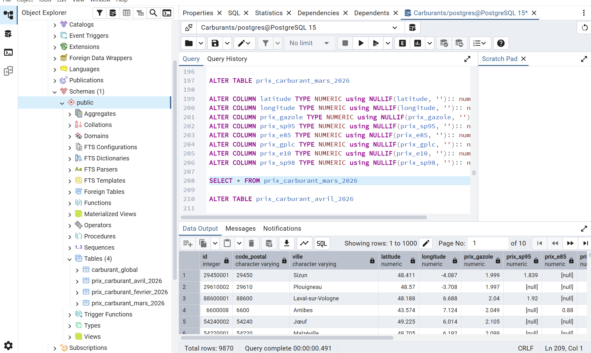
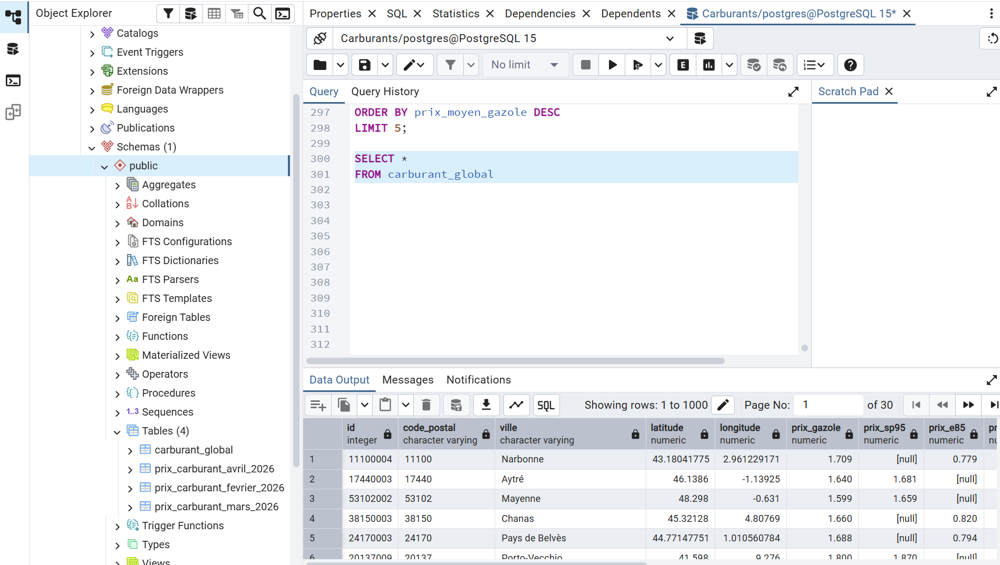
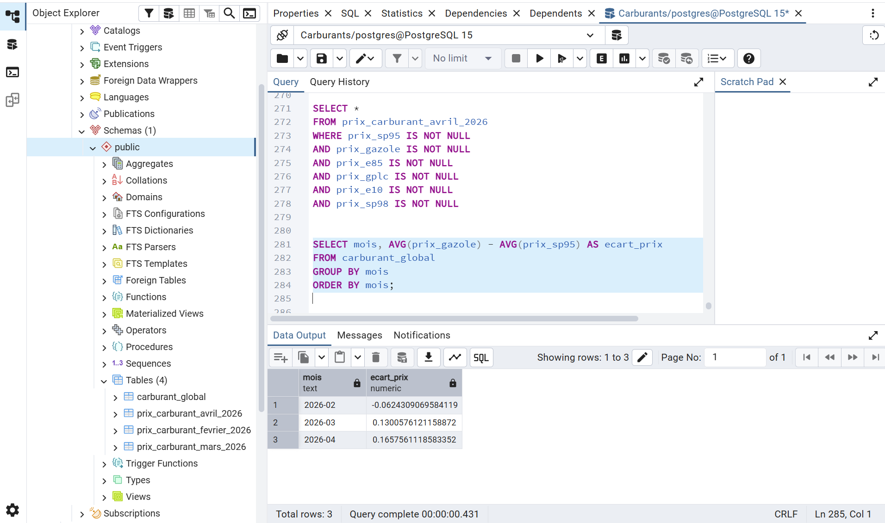
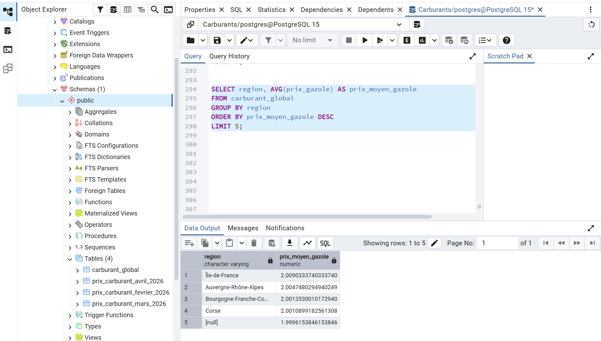
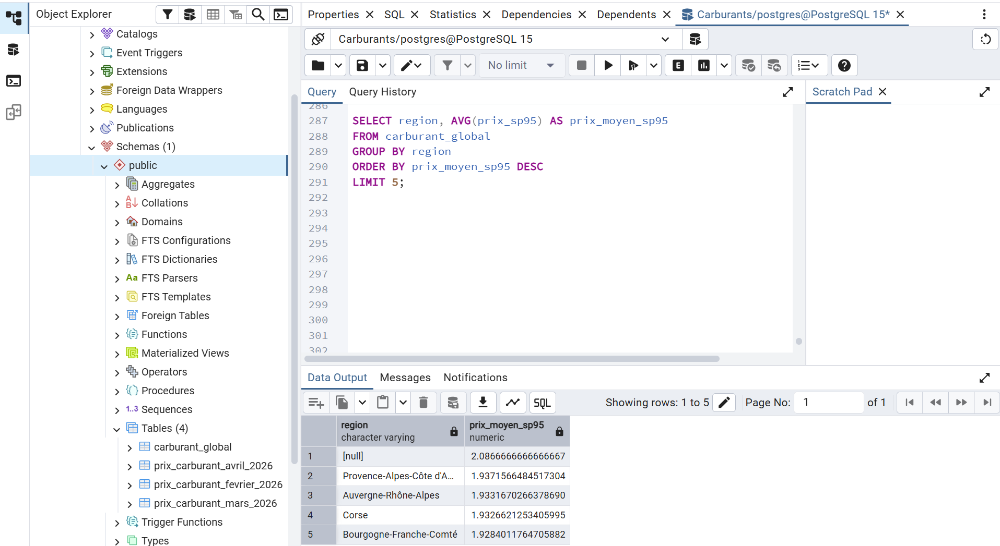

# PostgreSQL Data Cleaning & Transformation

This folder contains the SQL cleaning, transformation, and preparation steps performed in PostgreSQL before visualization in Power BI.

---

## Objectives

The PostgreSQL phase was used to:
- clean raw datasets
- standardize data structure
- merge datasets
- prepare analytical tables for Power BI

---

## Main SQL Operations

### Data Cleaning
- handling null values
- removing duplicates
- correcting data types
- validating numerical fields

---

### Data Transformation
- restructuring tables
- creating calculated columns
- merging monthly datasets
- preparing regional analysis tables

---

## SQL Analysis Examples

Main analyses included:
- fuel price evolution
- diesel vs SP95 comparison
- regional fuel price disparities
- average fuel price calculations

---

## Workflow Purpose

This step transformed raw datasets into reliable analytical tables optimized for dashboard creation and business analysis.

---

## Technologies Used

- PostgreSQL
- pgAdmin

---

## SQL Workflow Preview

### Data Cleaning

---

### Consolidated Global Table

---

### SP95 vs Diesel Gap Analysis

---

### Top 5 Most Expensive Diesel Regions

---

### Top 5 Most Expensive SP95 Regions

